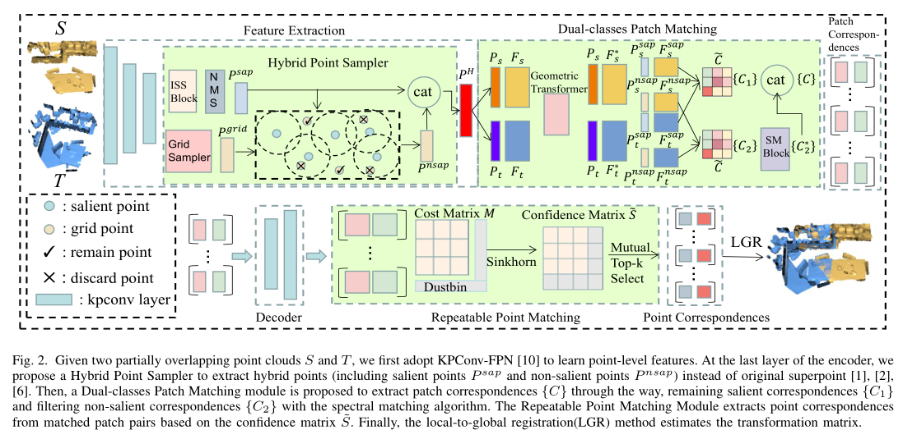

# HybridPoint: Point cloud registration based on hybrid point sampling and matching

🔥🔥🔥**Our paper is accepted by IEEE International Conference on Multimedia & Expo 2023**🔥🔥🔥

[HybridPoint: Point cloud registration based on hybrid point sampling and matching]().

🚀🚀The camera_ready version of our paper will be released within several days🚀🚀
# Autuor
Yiheng Li[1],Caihui Tang[1],[Runzhao Yao](https://scholar.google.com.sg/citations?user=udCF7q4AAAAJ)[1],Aixue Ye[2],Feng Wen[2],[Shaoyi Du](https://scholar.google.com.hk/citations?user=r2bk4sQAAAAJ)[1]

1:National Key Laboratory of Human-Machine Hybrid Augmented Intelligence,
  National Engineering Research Center for Visual Information and Applications,
  and Institute of Artificial Intelligence and Robotics, 
  Xi’an Jiaotong University, Xi’an, China
  
2:Huawei Noah's Ark Lab, Beijing, China

Corresponding E-mail: yihengli620@gmail.com
# Introduction
Patch-to-point matching has become a robust way of point cloud registration. However, previous patch-matching methods employ superpoints with poor localization precision as nodes, which may lead to ambiguous patch partitions. In this paper, we propose a HybridPoint-based network to find more robust and accurate correspondences. Firstly, we propose to use salient points with prominent local features as nodes to increase patch repeatability, and introduce some uniformly distributed points to complete the point cloud, thus constituting hybrid points. Hybrid points not only have better localization precision but also give a complete picture of the whole point cloud. Furthermore, based on the characteristic of hybrid points, we propose a dual-classes patch matching module, which leverages the matching results of salient points and filters the matching noise of non-salient points. Experiments show that our model achieves state-of-the-art performance on 3DMatch, 3DLoMatch, and KITTI odometry, especially with 93.0% Registration Recall on the 3DMatch dataset.


# Acknowledgements
The codes of our project mainly base on:

🏆[Geometric Transformer for Fast and Robust Point Cloud Registration](https://github.com/qinzheng93/GeoTransformer). (CVPR 2022)

Thanks for their contribution. Our project only need to replace some files in Geotransformer. Our method obtains performance improvement, and only adds a negligible amount of computation.

# Training Process
Firstly, download the code of [Geometric Transformer for Fast and Robust Point Cloud Registration](https://github.com/qinzheng93/GeoTransformer) or directly use the codes in our project which we download from https://github.com/qinzheng93/GeoTransformer previously.
```
Unzip GeoTransformer-main.zip
```
## 3DMatch & 3DLoMatch
```
Replace ./GeoTransformer-main/geotransformer/utils/data.py by ./3DMatch/data.py

Insert ./3DMatch/keypoints_detect.py in ./GeoTransformer-main/geotransformer/utils/

Replace ./GeoTransformer-main/experiments/geotransformer.3dmatch.stage4.gse.k3.max.oacl.stage2.sinkhorn/model.py by ./3DMatch/model.py

Set _C.coarse_matching.num_correspondences to 512 in ./GeoTransformer-main/experiments/geotransformer.3dmatch.stage4.gse.k3.max.oacl.stage2.sinkhorn/config.py

Then you can train or test by following the same methods as Geotransformer.(seeing in ./GeoTransformer-main/README.md)
```
## Kitti odometry
```
Replace ./GeoTransformer-main/geotransformer/utils/data.py by ./KITTI/data.py

Insert ./KITTI/keypoints_detect.py in ./GeoTransformer-main/geotransformer/utils/

Replace ./GeoTransformer-main/experiments/geotransformer.kitti.stage5.gse.k3.max.oacl.stage2.sinkhorn/model.py by ./KITTI/model.py

Set _C.coarse_matching.num_correspondences to 512 in ./GeoTransformer-main/experiments/geotransformer.kitti.stage5.gse.k3.max.oacl.stage2.sinkhorn/config.py

Then you can train or test by following the same methods as Geotransformer.(seeing in ./GeoTransformer-main/README.md)
```
## Pre-train model
The results of the newest pre-trained model are slightly better than the results shown in the paper.
The results evaluated based on pre-train model are as follows:

| Benchmark |  RR(%)  |  RRE(°)   |  RTE(m)   |
| :-------- | :---: | :---: | :---: |
| 3DMatch   | 93.4  | 1.550  | 0.050  |
| 3DLoMatch | 76.0  | 2.424  | 0.071  |

| Benchmark |  RR(%)  |  RRE(°)   |  RTE(cm)   |
| :-------- | :---: | :---: | :---: |
| KITTI   | 99.8  | 0.22  | 5.1  |

We employ local-to-global registration(LGR) method as an estimator of the transformation matrix instead of RANSAC, as LGR is a faster and more robust method than RANSAC. For all the method, we use 1000 correspondences for evaluation.

```
./weights_for_hybrid/3dmatch.tar for 3DMatch&3DLoMatch

./weights_for_hybrid/kitti.tar for Kitti odometry
```
# Citation
```bibtex
```
